# Все ключи, по одному

`design help КОМАНДА` отвечает коротко — так и задумано, справка в терминале должна помещаться на экран. Здесь наоборот: каждый ключ разобран целиком, с картинкой там, где эффект видно глазами, и с оговорками там, где он есть не всегда.

Картинки сняты на чистой виртуальной машине, а не на рабочем ноутбуке: в кадр не должны попадать чужие окна и рабочие адреса, а результат должен повторяться. Снимает их [tools/shots.sh](../tools/shots.sh) по плану из [tools/shots-all.sh](../tools/shots-all.sh) — сломался вид, откатил снапшот, прогнал заново, получил те же кадры.

Список ключей здесь не переписан руками, а читается из самого кода командой [tools/list-keys.sh](../tools/list-keys.sh), и [тест](../tests/test_docs.sh) падает, если в скрипте появился ключ, которого нет в этом файле. Справочник, расходящийся с программой, хуже, чем его отсутствие: ему верят.

**Общие ключи есть у каждой команды и ниже не повторяются:**

| Ключ | Что делает |
|---|---|
| `--help`, `-h` | справка по команде |
| `--dry-run` | рассказать, что было бы сделано, ничего не меняя |
| `--yes` | не задавать вопросов (для скриптов и раскатки) |
| `--quiet` | только итог, без пояснений |

## Оглавление

**Окно и его вид** · [buttons](#buttons) · [corners](#corners) · [theme](#theme) · [themes](#themes) · [icons](#icons) · [font](#font)

**Рабочий стол** · [widget](#widget) · [panel](#panel) · [wall](#wall) · [wallpapers](#wallpapers) · [look](#look)

**Программы** · [terminal](#terminal) · [tabby](#tabby) · [codium](#codium) · [app](#app) · [newtab](#newtab) · [serve](#serve)

**Порядок и откат** · [profile](#profile) · [keys](#keys) · [revert](#revert) · [tune](#tune) · [selftest](#selftest)

---

# Окно и его вид

## buttons

Кнопки заголовка — закрыть, свернуть, развернуть. GNOME их размер не настраивает, поэтому всё делается правилами CSS в `~/.config/gtk-3.0/gtk.css` и `gtk-4.0/gtk.css`, а значки подменяются темой-наследником.

#### `--size W H`

Ширина и высота кнопки в пикселях, по умолчанию `46 34`. На экране с высокой плотностью пикселей стоковые кнопки выглядят марками — отсюда и появился этот ключ.

```bash
design buttons --size 30 24
```


#### `--icon N`

Размер самого значка внутри кнопки в GTK4, по умолчанию `20`. Кнопку и значок специально развели: крупная кнопка с мелким значком — обычный приём, наоборот почти никогда не нужно.

#### `--gtk3-scale S`

То же для GTK3, но масштабом, по умолчанию `1.0`. Выше `1.3` значок начинает пикселить: GTK3 растягивает готовый растр, а не рисует его заново. Это не наш баг, а свойство движка — поэтому и вынесено отдельным ключом с другим смыслом, а не «размером».

#### `--hover COLOR`

Цвет подсветки под курсором. По умолчанию задан как `alpha(currentColor)` — то есть сам следует за цветовой схемой. Как только указываешь цвет явно, подсветка перестаёт подстраиваться: при переходе на светлую тему её придётся задать заново.

#### `--hover none`

Не трогать фон кнопки вовсе, оставить только размеры. Нужно темам, которые рисуют кнопки заголовка сами — WhiteSur и прочие macOS-подобные. Наши обычные правила гасят их фон, и кнопка становится пустой: значок теми рисуется как фон, а мы его убираем.

#### `--close COLOR`

Цвет кнопки закрытия, по умолчанию `#e81123` — красный из Windows. Единственная кнопка, которую полезно отличать от остальных: промах по ней стоит дороже всего.

```bash
design buttons --close e06c75
```


#### `--radius N`

Скругление подсветки, по умолчанию `0` — квадрат. Это радиус именно подсветки, а не окна: за углы окна отвечает [corners](#corners).

```bash
design buttons --radius 0
```


#### `--glyphs fluent|keep`

Откуда брать значки. `fluent` качает четыре значка с GitHub и собирает тему-наследника `<текущая>-dk-glyphs`: наследуется вся текущая тема значков, подменяются ровно четыре файла, папки и приложения остаются прежними. `keep` оставляет значки теме — это нужно темам, которые рисуют кнопки сами.

Побочные эффекты, о которых стоит знать заранее: нужен интернет, в настройках тема значков будет называться иначе, а если `~/.config/gtk-4.0/gtk.css` был симлинком внутрь темы — ссылка снимется, иначе наши правила уехали бы в тему.

#### `--diagnose`

Разобрать, почему значков не видно: проверяет наследника, наличие файлов, симлинки, порядок правил. Ключ появился после вечера, потраченного на «кнопки пустые» — оказалось, что установщик темы подменил `gtk.css` симлинком.

## corners

#### `--radius N`

Радиус скругления углов окон, меню и подсказок в пикселях. Mutter форму окна не настраивает — её задаёт только тема, поэтому правится через CSS.

```bash
design corners --radius 18
```

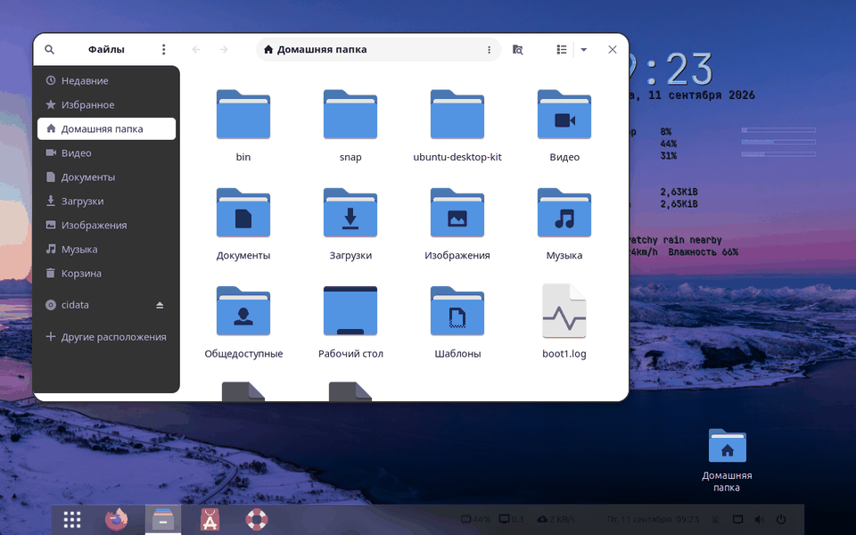

#### `--square`

То же, что `--radius 0` — строго прямые углы. Отдельный ключ, потому что «квадратные углы» — осознанный стиль, а не нулевое значение параметра: так выглядят Tabby и Windows.

```bash
design corners --square
```


## theme

#### `--list`

Только список установленных тем, без текущего состояния. Удобно, когда нужен точный вариант имени для другой команды.

#### `--install ИМЯ`

Собрать и поставить известную тему из исходников: Graphite, Orchis, Colloid, Fluent, WhiteSur, Qogir, Jasper. Клонирует репозиторий вендора и запускает его `install.sh` — это чужой код, выполняемый от твоего пользователя, и скрипт говорит об этом прямо.

#### `--light` / `--dark`

Светлая или тёмная цветовая схема **вместе с** парным вариантом текущей темы: `Graphite-Dark` становится `Graphite-Light`, `Yaru-dark` становится `Yaru`. Название темы знать не нужно — парный вариант ищется сам.

Если парного варианта в системе нет, команда не меняет **ничего** и показывает список установленных светлых тем. Это защита от рассинхрона, который однажды уже случился: тёмная тема при светлой схеме даёт половину окон серыми и нечитаемыми.

```bash
design theme --light
```


```bash
design theme --dark
```


#### `--scheme-only`

Поменять только цветовую схему, тему окон не трогать. Осознанное нарушение правила выше — нужно, когда тема одна на обе схемы и парного варианта не существует.

#### `--gtk4` / `--no-gtk4`

Подключить тему к новым приложениям или отключить от них. Файловый менеджер, Настройки и всё, что написано на libadwaita, темы GTK игнорируют — поэтому меняешь тему, а они остаются стандартными. Флаг добавляет `@import` файла темы в `~/.config/gtk-4.0/gtk.css`, и наши кнопки с углами при этом остаются на месте.

Работает, только если у темы есть каталог `gtk-4.0`; у стоковых Adwaita и Yaru его нет.

## themes

Банк проверенных тем. В него попали только те, что **не рисуют кнопки заголовка сами** — то есть такие, где наши значки остаются на месте. Проверено по исходникам каждой темы, а не по описанию на её странице.

#### `--install ИМЯ [ИМЯ...]`

Скачать и собрать одну или сразу несколько тем банка. Установщики запускаются в пакетном режиме: они только собирают тему, не задают вопросов и не применяют её сами.

История ключа поучительная. Палитры от Fausto-Korpsvart на середине установки спрашивали «Do you want to apply Vague?» и ждали ответа — а при запуске из скрипта отвечать было некому, и со стороны это выглядело зависанием. Тот же режим запрещает установщику переделывать `gtk-4.0/gtk.css` в симлинк, так что кнопки заголовка установку переживают.

Если связь с GitHub рвётся на середине — у крупных тем это обычное дело — скачивание повторяется на HTTP/1.1, а затем архивом через curl, который умеет докачку.

#### `--all`

Поставить весь банк разом. Занимает время и место; сколько именно — видно в выводе `design themes` перед установкой.

#### `--check ИМЯ`

Проверить уже установленную тему: рисует ли она кнопки сама, есть ли у неё каталог `gtk-4.0`, совместима ли с нашими правилами. Ответ на вопрос «почему с этой темой кнопки пустые» — до того, как он возникнет.

## icons

#### `--list`

Список установленных тем значков. Один набор часто даёт несколько тем сразу — тёмную, светлую, цветные, — поэтому после установки смотреть стоит именно сюда.

#### `--bank`

Готовые наборы, которые можно скачать, с размерами и пометкой, что уже стоит.

#### `--get ИМЯ`

Скачать и собрать набор из банка. Ставится в `~/.local/share/icons` — системные каталоги не трогаются, sudo не нужен. Исходники остаются в `~/.cache/desktop-kit`, чтобы переустановка была быстрой.

#### `--clean`

Снести скачанные исходники, не трогая установленные темы. У крупных наборов это сотни мегабайт.

#### `--folders ЦВЕТ`

Перекрасить папки Papirus: `adwaita black blue bluegrey breeze brown cyan green grey indigo magenta nordic orange pink red teal violet white yaru yellow`.

```bash
design icons --folders blue
```

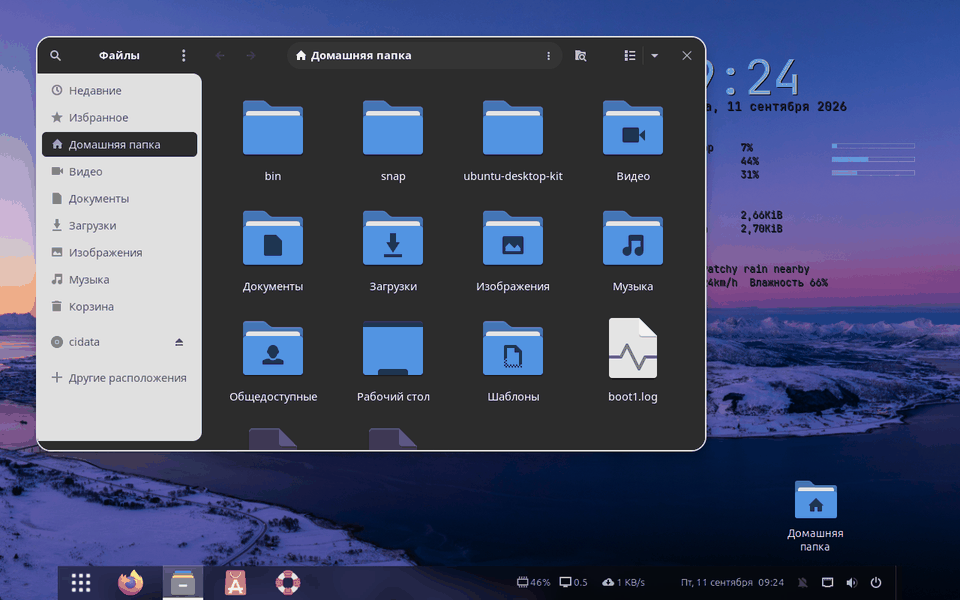

Работает через `papirus-folders` и меняет саму тему Papirus **на диске**, поэтому наследники подхватывают цвет автоматически. Отсюда два следствия: тема часто лежит в `/usr/share/icons` и тогда нужен sudo, а обновление пакета `papirus-icon-theme` через apt сбросит цвет — команду придётся повторить. Откатить можно только другой перекраской.

## font

#### `--list`

Семейства шрифтов, установленные в системе. Имя из этого списка и подставляется в команду.

#### `--mono "Имя Размер"`

Моноширинный шрифт — терминал, редакторы, всё, где важна ширина символа. Отделён от основного намеренно: интерфейсный шрифт и шрифт кода почти никогда не совпадают.

Имя проверяется по `fc-list`, несуществующий шрифт не применяется — иначе система молча откатится на умолчание, и причину потом не найти.

---

# Рабочий стол

## widget

Виджет conky: часы, загрузка системы, сеть, погода. У conky нет своего скругления ни в одной версии, поэтому подложку рисует Lua через Cairo, а собственное окно conky делается прозрачным.

#### `--radius N`

Скругление углов подложки, по умолчанию `12`.

```bash
design widget --radius 18
```


#### `--square`

Без скругления — то же, что `--radius 0`. Отдельный ключ по той же причине, что и у [corners](#corners): это стиль, а не ноль.

```bash
design widget --square
```

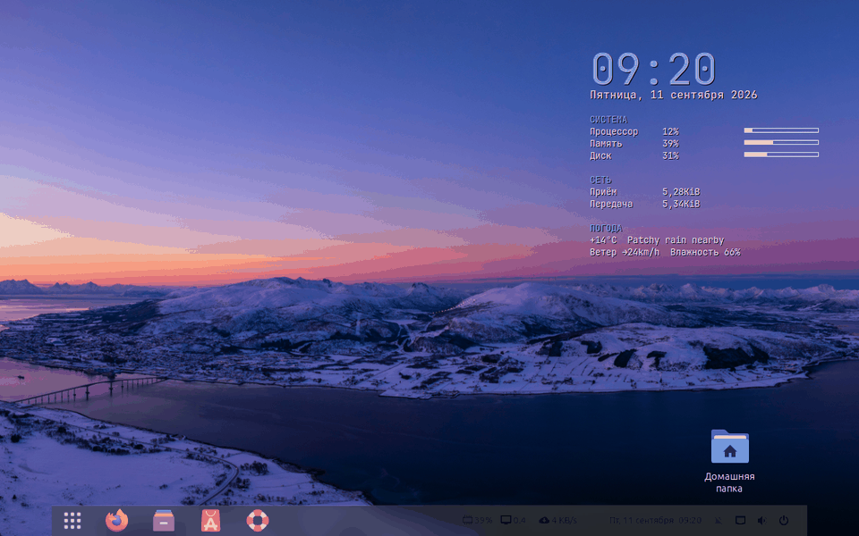

#### `--opacity N`

Плотность подложки от 0 до 255. Не проценты — это значение `own_window_argb_value` самого conky, и врать про единицы измерения было бы хуже, чем показать настоящие.

```bash
design widget --opacity 120
```


#### `--colour HEX` (он же `--color`)

Цвет подложки. Английское написание тоже принимается: помнить, какой вариант выбрал автор, — не работа пользователя.

```bash
design widget --colour 8ab4f8
```


#### `--text HEX` (он же `--text-colour`)

Цвет текста виджета, отдельно от подложки. Разделение не прихоть: при переходе системы на светлую тему conky за ней не идёт, и правка одной лишь подложки даёт белый текст на белом.

#### `--light` / `--dark`

Согласованная пара — светлая подложка с тёмным текстом или наоборот. То, что в ручном режиме приходится делать двумя ключами и помнить про контраст. Если подложка и текст оказались одной яркости, скрипт предупредит.

```bash
design widget --light
```

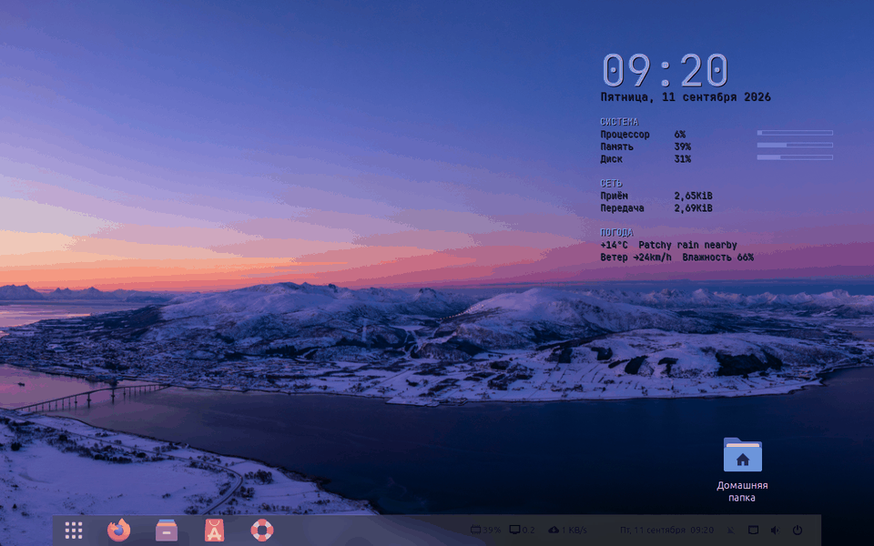

## panel

Панель задач Dash to Panel. Оговорка, стоившая часа: прозрачность в этом расширении задаётся **одна на все мониторы** — отдельной настройки для каждого экрана нет, сколько ни выбирай монитор в его собственных настройках.

#### `--opacity N`

Прозрачность подложки, 0..100.

#### `--transparent`

Полностью прозрачная подложка — панель растворяется, остаются только значки.

```bash
design panel --transparent
```

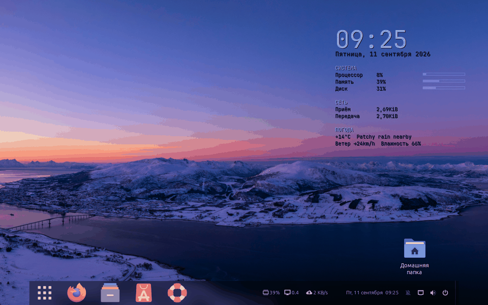

#### `--size N`

Высота панели в пикселях.

```bash
design panel --size 64
```

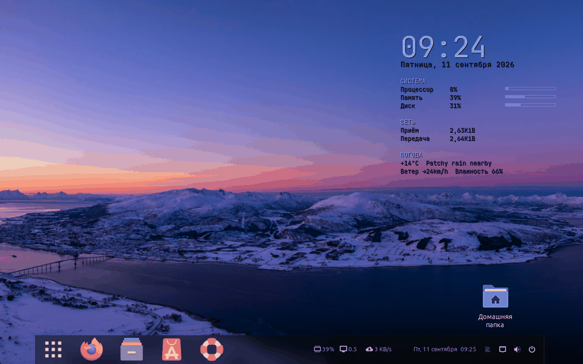

#### `--length N`

Длина панели в процентах ширины экрана. Хранится в расширении JSON-строкой с ключом по монитору, и на чистой системе там пусто — поэтому команда правит не текст регулярным выражением, а собирает значение заново.

#### `--float`

Стеклянная панель по центру: длина 88%, подложка прозрачная. Готовое сочетание, а не один параметр.

```bash
design panel --float
```

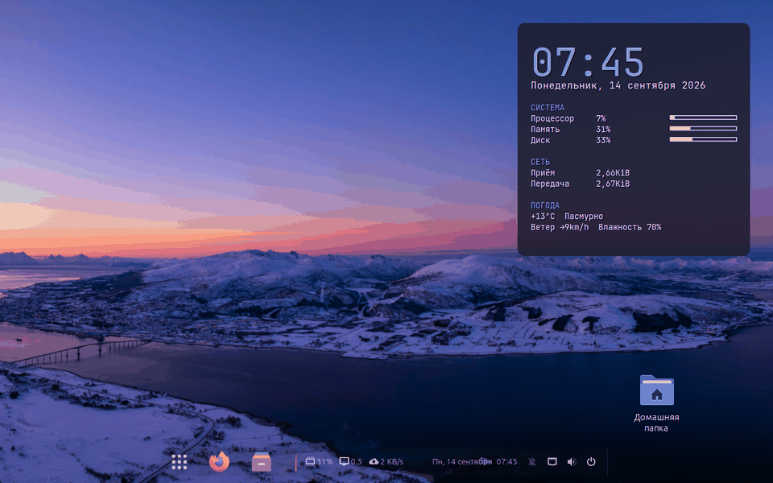

#### `--full`

Вернуть во всю ширину. Обратное к `--float`.

```bash
design panel --full
```

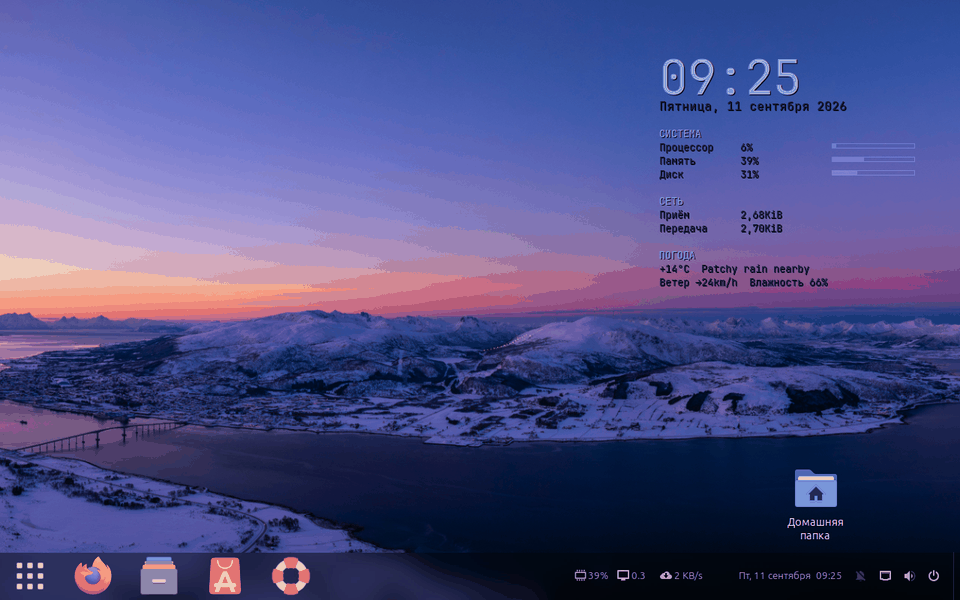

## wall

#### `--random`

Случайная картинка из банка вместо следующей по порядку.

```bash
design wall --random
```

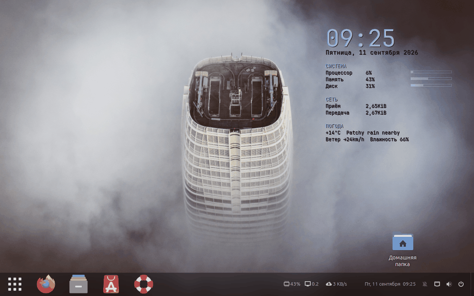

#### `--prev`

Предыдущая. Позиция запоминается **именем файла**, а не номером: банк пополняется, и номер бы съезжал.

#### `--set ФАЙЛ`

Конкретная картинка.

#### `--show`

Какая стоит сейчас и какая она по счёту.

**Что меняется помимо обоев рабочего стола:** обои экрана блокировки, режим вписывания (`zoom`), палитра GNOME Terminal — она идёт за картинкой через pywal, так что настройки из `terminal --palette` будут перезаписаны, — и пересобирается страница новой вкладки.

## wallpapers

#### `--init`

Первая заливка банка — 250 картинок под родное разрешение монитора.

#### `--count N`

Добрать N картинок вместо десяти по умолчанию.

#### `--status`

Что в банке, какое расписание, когда были последние запуски.

#### `--urls`

Показать, какие запросы уйдут на wallhaven, ничего не скачивая. Набор тем и seed привязаны к номеру недели: внутри недели выдача повторяется, следующая неделя приносит другое.

#### `--timer Wed 13:00` / `--timer off`

Пополнять по расписанию или снять расписание. День будний не случайно: рабочий ноутбук по выходным выключен, а `Persistent` лишь отложил бы запуск до понедельника, свалив всё в одну кучу.

#### `--prune N`

Оставить N самых свежих картинок. Банк растёт быстрее, чем кажется.

#### `--export [ФАЙЛ]`

Записать список банка — имена файлов, по одному на строку — в `walls/manifest.txt` репозитория. Запускается на машине, где банк полный.

#### `--sync [ФАЙЛ]`

Донести банк по этому списку: чего нет — скачать, что есть — не трогать. Запускается на остальных машинах; список берётся рядом со скриптом, а если его там нет — прямо из репозитория по сети.

**Зачем это нужно.** Экраны попадают в кадр видео, и обои на всех машинах должны быть одни и те же. Очевидное решение — положить картинки в git — не годится: два гигабайта двоичных файлов останутся в истории навсегда, и каждый клон будет тянуть их целиком.

Выручает свойство wallhaven: имя файла однозначно задаёт ссылку, первые два символа идентификатора становятся каталогом.

```
wallhaven-l3jvmp.jpg  →  https://w.wallhaven.cc/full/l3/wallhaven-l3jvmp.jpg
```

Значит в репозиторий едет список имён — 685 строк вместо двух гигабайт, а картинки каждая машина доносит сама. Подробнее: [walls/README.md](../walls/README.md).

## look

#### `--list`

Список образов: `work`, `night`, `paper`.

#### `--show`

Показать, из чего состоит образ, не применяя его. Образ — это не один параметр, а согласованный набор: тема, значки, кнопки, углы, панель, виджет, терминал.

Перед применением текущий вид сам сохраняется снимком `before-look`, вернуться — `design profile load before-look`. Обои образ не трогает: они дело вкуса и лежат отдельно.

---

# Программы

## terminal

GNOME Terminal. Оговорка, без которой ключи кажутся сломанными: `gnome-terminal-server` переживает закрытие всех окон и держит старые настройки, поэтому после правки нужен `pkill -x gnome-terminal-server`.

#### `--opacity N`

Прозрачность фона, 0..100, где 0 — непрозрачный. Да, шкала обратная привычной: так её задаёт сам GNOME Terminal, и переворачивать её в скрипте значило бы расходиться с его же настройками.

```bash
design terminal --opacity 45
```


#### `--font "Имя Размер"`

Шрифт терминала, отдельно от системного моноширинного.

#### `--palette wal`

Взять цвета из текущей палитры pywal — то есть из обоев. Учти порядок: `wall` тоже трогает палитру, так что смена обоев после этой команды перезапишет цвета.

#### `--show`

Текущие настройки профиля: прозрачность, шрифт, цвета.

## tabby

У Tabby прозрачность устроена в два слоя, и это главное, что нужно знать. Acrylic делает полупрозрачным **само окно**, но область терминала внутри рисует xterm отдельным слоем — она остаётся плотной. Поэтому «стекло» получается только правкой Custom CSS.

Отсюда же ответ, почему тут не подходит `app --opacity`: тот способ гасит окно целиком, вместе с плашкой вкладок, и вид становится мутным. Здесь крутится ровно одно число — плотность фона терминала.

#### `--alpha N`

Плотность фона терминала: `0.10` — обои читаются насквозь, `0.30` — текст виден на любых обоях (рабочее значение), `0.40` — почти глухой фон.

#### `--ui HEX`

Цвет плашки вкладок. Её обычно оставляют плотной: полупрозрачные вкладки поверх полупрозрачного терминала читаются плохо.

#### `--bg HEX`

Цвет фона терминала, который дальше разбавляется прозрачностью.

#### `--revert`

Снять только наш блок, чужие правила в Custom CSS не трогая.

**Править конфиг нужно при закрытом Tabby** — он держит настройки в памяти и перезаписывает файл при выходе. Скрипт проверяет это сам и отказывается работать, пока программа запущена. Подробный разбор — [tabby.md](tabby.md).

## codium

#### `--txt`

Текст как текст: `*.txt` жёстко объявляется языком `plaintext`, гасятся рамки вокруг русских слов и подсветка повторов, а `text/plain` отдаётся VSCodium.

#### `--alt`

`Alt` перестаёт уводить фокус в строку меню. Нужно всем, у кого раскладка переключается на `Alt+Shift`: каждая смена языка выбрасывала курсор в `File / Edit / Selection`.

#### `--all`

И то, и другое сразу.

#### `--revert`

Снять наш блок целиком и вернуть прежнее приложение для `.txt`.

Флаги накапливаются, а включённые части читаются из самого файла настроек. Подробный разбор обеих ловушек — в [commands.md](commands.md#текст-который-читается-как-текст).

## app

#### `--theme ТЕМА`

Своя тема GTK для одного приложения — через его же ярлык в `~/.local/share/applications`. Правятся **все** строки `Exec`, включая пункты контекстного меню дока: иначе «Написать письмо» откроется в прежней теме.

Работает только для GTK-приложений. Kate и прочие Qt настраиваются через qt6ct или Kvantum.

#### `--reset`

Убрать наш ярлык. Ярлык, который ты сделал сам, командой не удаляется — она трогает только помеченные ею же.

#### `--opacity N`

Прозрачность окна: 100 — непрозрачно, 85 — заметно просвечивает. Работает с любым приложением, включая Electron, потому что значение пишется в свойство окна `_NET_WM_WINDOW_OPACITY`, которое читает композитор.

Свойство живёт вместе с окном, поэтому команда сразу поднимает сторожа и кладёт его в автозапуск: он вешает прозрачность на новые окна сам, раз в две секунды.

**Только X11.** На Wayland свойств окон X11 не существует, и доступа к чужим окнам тоже.

#### `--once`

Поставить прозрачность только текущим окнам, без сторожа. Разовый эффект — исключение, поэтому он под флагом, а удержание работает по умолчанию.

#### `--keep`

Явно попросить то, что и так делается по умолчанию. Оставлен ради совместимости с командами, записанными раньше.

#### `--windows`

Таблица: какие окна открыты, как они называются для команды и что на них сейчас стоит. Первое поле — текущая прозрачность, второе — имя из `WM_CLASS`, третье — заголовок. Плюс строка о том, жив ли сторож.

Ключ появился из разбора «не сработало»: по одному выводу видно и настоящее имя окна, и лежит ли на нём свойство.

## newtab

Своя страница новой вкладки Chrome: часы, плитки-ярлыки и обои фоном — причём никогда та же картинка, что стоит на рабочем столе прямо сейчас. Фон листается стрелками и запоминается между вкладками.

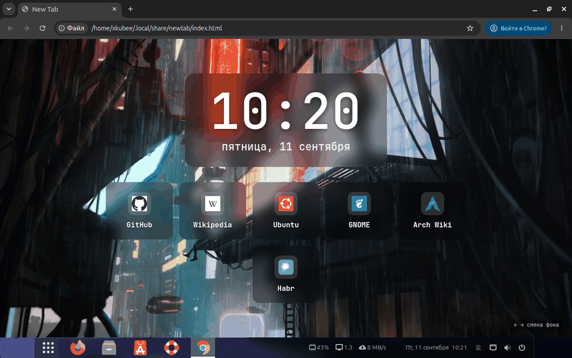

#### `--rebuild`

Пересобрать страницу новой вкладки заново.

#### `--add "Имя|URL"` / `--remove Имя` / `--list` / `--edit`

Ярлыки на странице. Значки берутся из локального кэша Chrome, поэтому внутренние адреса получают настоящие иконки; найденный значок запоминается и не теряется, даже если база потом промолчит.

#### `--clock N`

Размер часов, по умолчанию `110`.

#### `--tile N`

Ширина плитки, по умолчанию `130`. Оба размера в одном кадре — часы `150`, плитки `180`: ярлыки переносятся на вторую строку сами, ширина страницы под них не подстраивается.

```bash
design newtab --clock 150 --tile 180
```

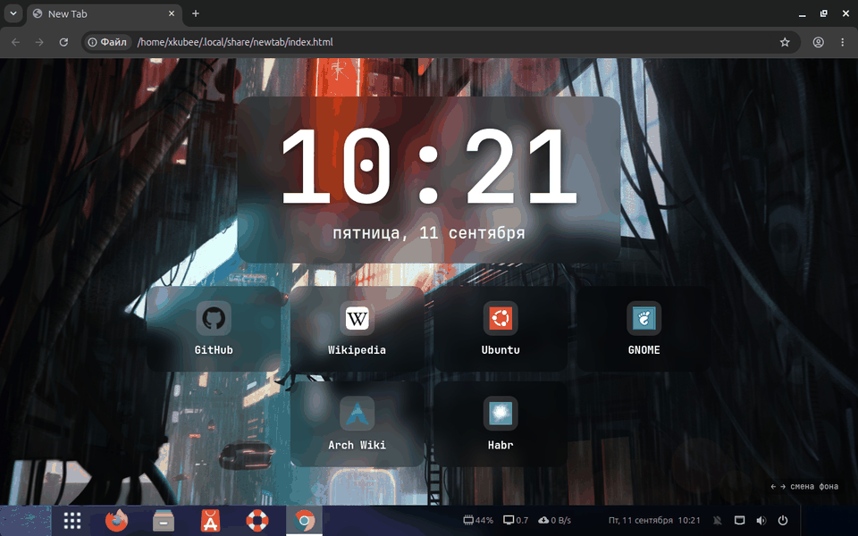

Подключение страницы к новой вкладке требует расширения — Chrome иначе не даёт. Подробности: [chrome.md](chrome.md).

Оба кадра сняты в настоящем Chrome на стенде, ярлыки в них нарочно нейтральные.

## serve

#### `--port N`

Порт локальной апки. Слушает только `127.0.0.1` — из сети недоступна.

#### `--list`

Какие апки подняты.

#### `--stop ИМЯ`

Снять службу. Служба **постоянная**: это systemd-юнит с автозапуском при входе, а не сервер на время сессии.

---

# Порядок и откат

## profile

#### `--list`

Список снимков оформления.

`profile save ИМЯ` запоминает, как всё выглядит сейчас; `load` возвращает; `show` показывает содержимое; `drop` удаляет. Имя можно не писать: `save` назовёт снимок по дате, `load` возьмёт последний.

В снимок попадают тема и схема, значки, шрифты, курсор, раскладка кнопок заголовка, обои и файлы `gtk-3.0/gtk.css` и `gtk-4.0/gtk.css` целиком. Самих тем и наборов значков там нет — они весят гигабайты, запоминаются только имена.

Отличие от `revert`: тот возвращает «как было до нашего первого вмешательства», а `profile` — «как было в момент, который ты выбрал».

## keys

#### `--add "Имя|Команда|Клавиши"`

Своё сочетание. Формат GNOME: `<Control>q`, `<Super>space`, `<Control>KP_Multiply` — это серая звёздочка на цифровом блоке.

#### `--remove Имя`

Убрать по имени.

#### `--defaults`

Набор из этого проекта: `Ctrl+Q` — скриншот области, `Ctrl+` серая звёздочка и `Ctrl+` серая косая — обои вперёд и назад.

Занятые системой сочетания GNOME не отдаст, причём молча: команда отработает, а клавиша не сработает. Тогда смотреть в Настройки → Клавиатура → Комбинации клавиш.

## revert

#### `--list`

Что вообще можно откатить и что запомнено. Подсистемы независимы: `revert theme` не трогает значки и шрифт. Раньше было иначе, и откат темы уносил заодно значки — отсюда и разделение.

Возвращаются те значения, что были **до первого изменения**, а не умолчания системы. Обои, банк картинок и расписание не откатываются никогда: это данные, а не настройки вида.

## tune

Настройка вопросами: команда проводит по подсистемам и спрашивает значения, показывая, что получится. Своих ключей, кроме общих, у неё нет — она сама и есть диалог.

Нужна, когда не знаешь, чего хочешь: перебирать `buttons --size` вслепую дольше, чем ответить на пять вопросов и посмотреть.

## selftest

#### `--full`

Полная проверка с применением и откатом — в песочнице с подставными `gsettings`, `dconf`, `curl` и systemd. Живые настройки при этом не трогаются вообще.

#### `--only ГРУППА [ГРУППА]`

Одна или несколько групп вместо всех. Опечатка в имени группы раньше давала бодрое «всё прошло», не запустив ничего, — теперь команда проверяет имена и отказывается работать с неизвестным.

#### `--list`

Какие группы есть.
